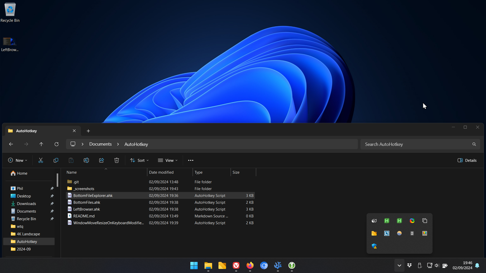
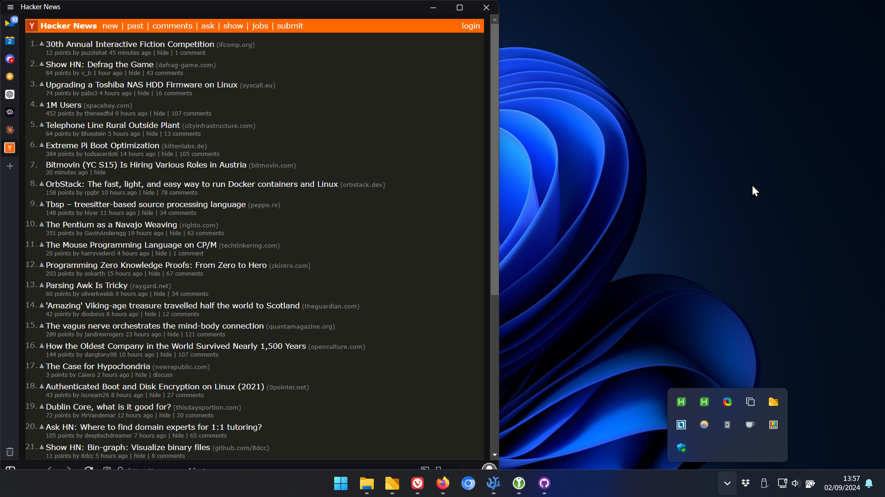

# AutoHotkey V2 Productivity scripts

A collection of [AutoHotKey](https://www.autohotkey.com/) v2 scripts for ergonomics, window management etc.

## BottomFileExplorer.ahk

Pressing `ALT + \` will toggle windows file explorer at the bottom of your screen. 
- It's always 100% width, but remembers height
- not tested yet with multi monitor

`BottomFiles.ahk` is an alternate version that does the same thing but to uses another application for file navigation .e.g [Files](https://files.community)

## LeftBrowser.ahk

Pressing `SUPER + \` OR touching mouse cursor to left screen edge for around 500ms will toggle a dedicated browser (by default `vivaldi.exe`). Install a browser just for this usecase, a portable version if you need to keep things tidy. Vivaldi is a good choice because it has options for left tabs and can be resized to just the favicon.

## MoveWindowsWithModifier.ahk (WIP)

The idea here is to replicate BetterTouchTool on MacOS which allows windows under the cursor to be moved while `CTRL` is held down, resize with `CTRL + SHIFT`. I've tried a few versions of this and its too erratic too use right now.